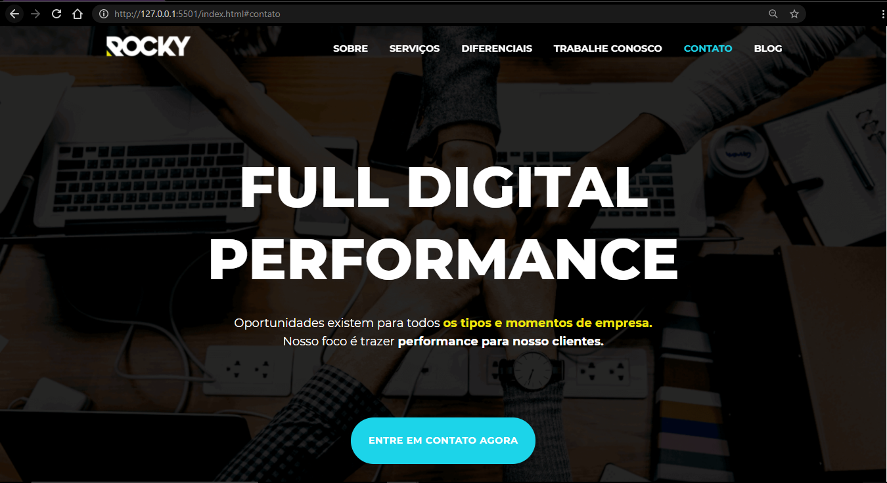

# Rocky Project
Website page, using HTML, CSS and JavaScript. 

### 🚀 Starting
To start the project, it is necessary to open it in `"Visual Studio Code"`.  
And use the `"Open with Live Server"` extension, to the acess the `index.html`.  

---

### 💻 Versão Web
  

### 📱 Versão Mobile
  

---
#### Coded by Milena Soares 
